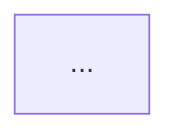

# Conversation Threads

Persistent, resumable conversation summaries stored as markdown files. Each thread captures
decisions, context, and open items so a conversation can span multiple sessions, machines,
and even different people picking up the same topic.

## Core Concepts

**Thread** — a markdown file in the threads directory with YAML frontmatter and
structured sections. One thread per topic.

**INDEX.md** — auto-generated table of all threads, grouped by status. Never edit it
manually — it is derived from thread frontmatter.

**GRAPH.md** — auto-generated Mermaid dependency graph of thread relationships and
item blocking chains. Never edit it manually — it is derived from thread frontmatter.

**Frontmatter** — YAML metadata at the top of each thread. Source of truth for status,
description, relationships, and timestamps.

## Storage

Default location: `.claude/threads/`

If an `INDEX.md` exists in a different location and the project's CLAUDE.md or configuration
points to it, use that location instead. Otherwise, always use the default.

## .state File

The `.claude/threads/.state` file tracks which thread is active per session. **Always
update it using `Bash` with `sed`, never using the `Edit` tool.** The Edit tool may
prompt for permissions on dotfiles inside `.claude/` subdirectories, while Bash/sed
runs without prompting.

```bash
sed -i "s/^${CLAUDE_SESSION_ID}=.*/${CLAUDE_SESSION_ID}=thread-name/" .claude/threads/.state
```

## Thread Format

Every thread is a markdown file with YAML frontmatter followed by required core sections
and optional freeform sections.

### Frontmatter

```yaml
---
status: active
summary: short free-text about current state
description: one-line summary of what this thread is about
last_updated: 2026-03-01
progress: 2o/5r/2d
priority: P1
id_prefix: BA
items:
  - id: BA-1
    title: Pagination strategy for list endpoints
  - id: BA-2
    title: Rate limiting middleware
    priority: P0
  - id: BA-3
    title: WebSocket support
    status: deferred
  - id: BA-4
    title: Response caching layer
    status: deferred
    blocked_by: DI-2
related:
  - blocks: frontend-ui
  - blocked-by: deployment-infra
---
```

**Fields:**

| Field | Required | Description |
|-------|----------|-------------|
| status | yes | One of: `active`, `blocked`, `parked`, `closed` |
| summary | yes | Free-text elaboration on current state |
| description | yes | One-line summary for INDEX.md scanning |
| last_updated | yes | ISO date, updated on every change |
| progress | yes | Item counts as `Xo/Yr/Zd` — open/resolved/deferred (see Progress Tracking) |
| priority | no | `P0` (critical — blocks other work), `P1` (high — near-term goals), `P2` (normal — default if omitted), `P3` (low — cleanup, nice-to-have). Orthogonal to status — a parked P1 thread is valid. Drives sort order in INDEX.md and cross-thread views. |
| id_prefix | no | Short uppercase prefix for item IDs (e.g., `BA` for backend-api, `FU` for frontend-ui). Derived from first letter of each word in thread name if omitted. Set once at thread creation; never changed. Used to construct stable item IDs like `BA-1`, `FU-2`. |
| items | no | Structured list of open items for cross-thread scanning (see Item Index below). |
| related | no | Typed list of thread relationships |

### Required Core Sections

Every thread must have these sections, in this order, after the frontmatter:

```markdown
# Thread Title

## Context
Why this thread exists. Background, motivation, scope.

## Decisions
| Question | Answer |
|----------|--------|
| ... | ... |

## Open Items
Numbered list of unresolved questions or tasks. Remove items as they are resolved
(move the answer to the Decisions table).
```

### Freeform Sections

Add whatever sections make sense for the topic after the core sections. Examples from
real threads: "Integration Points" tables, "Three Options" comparisons, "Documents
Produced" lists, "Key Design Points". The skill does not constrain these — they are
driven by the content.

### Item Index

Each thread maintains a structured `items:` list in frontmatter alongside the
prose `## Open Items` section. The frontmatter list is the authority for
cross-thread scanning (`/threads backlog`); the inline section is the authority
for reading. The skill keeps both in sync.

**Frontmatter `items:` entry fields:**

| Field | Required | Description |
|-------|----------|-------------|
| id | yes | Stable ID: thread's `id_prefix` + hyphen + monotonic number (e.g., `BA-1`). Never reused, even after resolution. |
| title | yes | Short name (matches the bold title in the inline Open Items entry). |
| priority | no | `P0`–`P3`. Overrides thread's `priority:` for this item. If omitted, inherits thread priority (default P2). |
| status | no | `open` (default if omitted), `blocked`, `deferred`. |
| blocked_by | no | ID of the blocking item (e.g., `DI-2`). Required when status is `blocked`. |

**Inline format:** Open Items entries reference their ID and carry visual echo
tags for readability in grep, diffs, and direct reading:

    1. [BA-1] **Pagination strategy for list endpoints** — description
    2. [BA-2] [P0] **Rate limiting middleware** — description
    3. [BA-3] [deferred] **WebSocket support** — description
    4. [BA-4] [deferred] [blocked:DI-2] **Response caching layer** — description

The `[ID]` tag is always first. Optional priority (`[P0]`–`[P3]`) and status
(`[deferred]`, `[blocked:ID]`) tags follow. Then the bold title and description.

**Editing model:** Inline Open Items is the editing surface — humans add, modify,
and tag items there. Frontmatter `items:` is the derived index — the skill
recomputes it from inline on every Update, Create, and Close. Scanners
(`/threads backlog`) read frontmatter, never parse inline. Inline tags are
visual echoes of the metadata that gets propagated to frontmatter.

**Sync rules:**
- The skill recomputes `items:` from the inline Open Items section on every
  Update, Create, and Close — same as it recomputes `progress:`.
- When an item is resolved (moved to Decisions table), remove it from both
  the inline section and the `items:` list. Its ID is retired — never reused.
- `progress:` is derived from `items:`: X (open) = items with no status or
  status `open`, Z (deferred) = items with status `blocked` or `deferred`,
  Y (resolved) = rows in Decisions table.

**ID prefix derivation:** When `id_prefix:` is not set in frontmatter, derive
from the thread filename: first letter of each hyphen-separated word, uppercase
(e.g., `backend-api` → `BA`, `deployment-infra` → `DI`). The skill
suggests this default when creating threads; the user can override.

## File Naming

Enforce **kebab-case** for all thread filenames. Convert the thread title automatically:

- "Model Server Deployment" → `model-server-deployment.md`
- "AI Coding Agent (OpenCode Fork)" → `ai-coding-agent-opencode-fork.md`

Strip parentheses, special characters, and excess whitespace. Lowercase everything.
Use hyphens as separators.

## Progress Tracking

Every thread tracks item progress in its frontmatter as `Xo/Yr/Zd`:

- **X (open)** — items in `items:` with no `status` or `status: open`
- **Y (resolved)** — rows in the `## Decisions` table (excluding header and separator rows)
- **Z (deferred)** — items in `items:` with `status: blocked` or `status: deferred`

For threads without an `items:` list, fall back to counting inline `## Open Items`
entries (blocked/deferred determined by `[deferred]` or `[blocked:X]` tags).

**When to update:** Recompute `progress` whenever items are added, resolved, or reclassified —
during Create (initial counts), Update (after any item change), and Close (final counts).

## Status Tags

Four statuses with specific meanings:

| Status | Meaning |
|--------|---------|
| `active` | Being worked on — this is a live topic |
| `blocked` | Waiting on something specific (explain in summary) |
| `parked` | Intentionally set aside — not blocked, just not being worked on now |
| `closed` | Done — decisions are final, no open items remain |

Closed threads stay in the threads directory (no archiving to a subdirectory).
The generated INDEX.md groups closed threads at the bottom.

## Related Threads

Express relationships between threads using a typed list in frontmatter:

```yaml
related:
  - blocks: server-deployment
  - blocked-by: opencode-fork
  - related: rbac-design
  - parent: infrastructure-overview
  - child: sidecar-implementation
  - supersedes: old-deployment-plan
  - superseded-by: new-deployment-plan
```

**Relationship types:** `blocks`, `blocked-by`, `related`, `parent`, `child`,
`supersedes`, `superseded-by`

**Auto-sync is mandatory.** When adding a directional relationship to one thread,
always add the inverse to the other:

- Adding `blocks: X` to thread A → add `blocked-by: A` to thread X
- Adding `parent: X` to thread A → add `child: A` to thread X
- Adding `supersedes: X` to thread A → add `superseded-by: A` to thread X
- `related` is symmetric — add `related: A` to X and `related: X` to A

## INDEX.md Generation

INDEX.md is **auto-generated** from thread frontmatter. Regenerate it whenever a thread
is created, updated, merged, forked, or has its status changed.

**Format:**

```markdown
# Conversation Threads

## Active

| Thread | Priority | Description | Status | Updated |
|--------|----------|-------------|--------|---------|
| [backend-api](backend-api.md) | P1 | Backend API — endpoints, middleware, data layer | active — 12 decisions, 4 open items | 2026-03-21 |
| [frontend-ui](frontend-ui.md) | P2 | Frontend UI — components, state management, routing | active — scoping, 6 open items | 2026-03-12 |

## Blocked

| Thread | Priority | Description | Status | Updated |
|--------|----------|-------------|--------|---------|
| ... |

## Parked

| Thread | Priority | Description | Status | Updated |
|--------|----------|-------------|--------|---------|
| ... |

## Closed

| Thread | Priority | Description | Status | Updated |
|--------|----------|-------------|--------|---------|
| ... |
```

Omit sections that have no threads (don't show an empty "Blocked" table). The Status
column shows the tag plus the summary. Thread names link to the file. Within each
status section, sort by priority (P0 first), then alphabetically within same priority.
Threads without explicit `priority:` show `P2`.

## GRAPH.md Generation

GRAPH.md is **auto-generated** from thread frontmatter, parallel to INDEX.md. Regenerate
it whenever INDEX.md is regenerated — same triggers (create, update, close, merge, fork,
link, rename, and explicit index).

**File structure:**

```markdown
# Dependency Graph

## Thread Relationships



## Item Dependencies


```

### Thread-Level Graph

Shows all non-closed threads as nodes and their `related:` relationships as edges.

**Nodes:**
- Include all non-closed threads (including orphans with no relationships)
- Node ID: thread name with hyphens converted to underscores (e.g., `api_surface_design`)
- Node label: original thread name in square bracket quotes (e.g., `["api-surface-design"]`)
- Style nodes by status using `classDef`:
  ```
  classDef active fill:#4ade80,stroke:#166534
  classDef blocked fill:#f87171,stroke:#991b1b
  classDef parked fill:#fbbf24,stroke:#92400e
  ```
- Apply with `:::` syntax: `api_surface_design["api-surface-design"]:::active`

**Edges:**
- Directional relationships (`parent`/`child`, `blocks`/`blocked-by`, `supersedes`/`superseded-by`):
  solid arrow with label. Example: `parent_thread -->|child| child_thread`
- Symmetric relationships (`related`): dotted line, no label.
  Example: `thread_a -.- thread_b`
- Skip edges where either endpoint is a closed thread

**Deduplication:** Thread relationships are auto-synced (declared on both sides). To
avoid duplicate edges, emit each edge exactly once:
- `parent`/`child`: emit from the parent side only
- `blocks`/`blocked-by`: emit from the blocks side only
- `supersedes`/`superseded-by`: emit from the supersedes side only
- `related`: emit only when `source_name < target_name` alphabetically

### Item-Level Graph

Shows cross-thread item blocking chains — items connected by `blocked_by` relationships.

**Nodes:**
- Only items involved in `blocked_by` relationships (both the blocker and the blocked item)
- Node label: item ID with thread name for context (e.g., `FE-2` from `future-enhancements`)
- Skip items from closed threads

**Edges:**
- `blocked_by` → arrow from blocker to blocked item, labeled "blocks"
- Example: `FE_2["FE-2"] -->|blocks| OF_1["OF-1"]`

**Omit the Item Dependencies section entirely** if no blocking relationships exist
among non-closed threads.

## Operations

### Argument Routing

Match the skill argument to an operation:

| Argument | Operation |
|----------|-----------|
| `init` | Initialize Project |
| `create` | Create |
| `capture` | Capture |
| (none) | Index |
| `index` | Index |
| `load <name>` | Load |
| `search <keyword>` | Search |
| `update [name]` | Update (defaults to active thread) |
| `close [name]` | Close (defaults to active thread) |
| `merge` | Merge (asks for source and target) |
| `fork [name]` | Fork (defaults to active thread) |
| `link` | Link (asks for threads and relationship) |
| `rename [name]` | Rename (defaults to active thread) |
| `priorities` | Priorities |
| `backlog` | Backlog |
| `help` | Help |
| anything else | Load (treat argument as thread name) |

### Initialize Project

When the user wants to set up conversation threads for a project that doesn't have them yet:

1. Create the threads directory (`.claude/threads/`)
2. Create an empty `INDEX.md` with the header and no threads
3. Add the CLAUDE.md pointer (see CLAUDE.md Integration below) — if CLAUDE.md doesn't
   exist, create it with just the pointer section; if it exists, append the section
4. Confirm to the user that the project is ready

This is idempotent — if the directory or INDEX.md already exists, skip those steps and
only add what's missing. If everything is already in place, tell the user the project
is already set up.

### Index

When the user asks what threads are available, or invokes `/threads` with no arguments:

1. Read all thread files in the threads directory
2. Regenerate INDEX.md and GRAPH.md from frontmatter (ensures it is current)
3. Present the INDEX.md table to the user
4. Check `last_updated` on all active and blocked threads. If any are older than 14 days,
   append a stale thread warning after the table listing thread names and age in days

### Load

When the user invokes `/threads <name>` or `/threads load <name>`:

1. Resolve the thread name to a file in the threads directory
2. If the file does not exist, inform the user — do not fall through to Create
3. Read the thread file's full contents into context
4. Update `.claude/threads/.state` via Bash/sed (see .state File section — never use Edit):
   ```bash
   sed -i "s/^${CLAUDE_SESSION_ID}=.*/${CLAUDE_SESSION_ID}=thread-name/" .claude/threads/.state
   ```
5. Present the thread's current state to the user

### Create Thread

When the user wants to start a new topic:

1. Get a thread title (ask if not provided)
2. Convert to kebab-case filename
3. Derive `id_prefix` from filename (first letter of each word, uppercase) — suggest to user, allow override
4. Create the file with frontmatter (status: active, progress: 0o/0r/0d, id_prefix) and empty core sections
5. Fill in Context based on what the user describes
6. Regenerate INDEX.md and GRAPH.md
7. Update `.claude/threads/.state` via Bash/sed (see .state File section)

### Capture From Conversation

When the user says "save this as a thread" or "turn this into a thread" mid-conversation:

1. Review the current conversation for decisions made, open questions, and context
2. Extract and organize them into the thread format
3. Ask the user for a thread title (suggest one based on the content)
4. Derive `id_prefix` from filename (suggest default, allow override)
5. Create the thread file with populated sections, `id_prefix`, and `items:` list
   (assign IDs to any captured open items, add inline `[ID]` tags)
6. Present the draft to the user for review before finalizing
7. Regenerate INDEX.md and GRAPH.md
8. Update `.claude/threads/.state` via Bash/sed (see .state File section)

This is different from Create — it retroactively structures an existing conversation
rather than starting blank.

### Update Thread

When decisions are made or the situation changes during a conversation:

1. Add new decisions to the Decisions table
2. Resolve open items (move to Decisions when answered, remove from Open Items and `items:` list)
3. Add new open items as they surface (assign next ID using thread's `id_prefix`, add to both inline and `items:` list)
4. Update frontmatter: summary, status if changed, last_updated, recompute progress from `items:`, sync `items:` with inline Open Items
5. Regenerate INDEX.md and GRAPH.md if frontmatter changed

Update incrementally — append to existing content, don't rewrite settled sections.

### Close Thread

When a topic is complete:

1. Check the Open Items section. If any items are unresolved, **list them explicitly
   to the user** and ask for confirmation before closing. Unresolved items represent
   decisions that were never made — silently clearing them loses information. The user
   might want to: resolve them now, move them to another thread, or acknowledge they
   are no longer relevant. Do not close without this confirmation step.
2. Set status to `closed`, update summary, clear `items:` list (should be empty —
   all items resolved or moved), recompute progress (should be `0o/Yr/Zd`)
3. Update last_updated
4. Regenerate INDEX.md and GRAPH.md (thread moves to Closed section)

### Merge Threads

When two threads converge into one topic:

1. Ask the user which thread survives (the "target") and which gets absorbed (the "source")
2. Merge the source's content into the target:
   - Combine Decisions tables (deduplicate, flag conflicts for user resolution)
   - Combine Open Items (deduplicate, preserve source item IDs as-is — different
     prefixes prevent collisions)
   - Merge `items:` lists in frontmatter (append source items to target list)
   - Merge Context sections (target's context first, then relevant source context)
   - Combine freeform sections (keep both, reorder if needed)
3. Union the Related links from both threads
4. Close the source thread with status `closed` and summary "merged into [target]"
5. Add `supersedes: [source]` to target, `superseded-by: [target]` to source
6. Regenerate INDEX.md and GRAPH.md

If decisions conflict between threads, present both to the user and ask which stands.

### Fork Thread

When a thread spawns a clearly separate subtopic:

1. Ask the user for the new thread's title and which content to move
2. Derive `id_prefix` for the new thread (suggest default, allow override)
3. Create the new thread with the extracted content — re-assign moved items with
   new IDs under the new prefix (e.g., RS-3 in original becomes FT-1 in fork),
   populate `items:` list, add inline `[ID]` tags
4. Remove the forked content from the original thread (remove from both inline
   Open Items and `items:` list, retire the old IDs)
5. Add `parent: [original]` to new thread, `child: [new]` to original
6. Regenerate INDEX.md and GRAPH.md

### Link Threads

When the user wants to express a relationship between threads:

1. Identify the relationship type (ask if ambiguous)
2. Add the relationship to the source thread's frontmatter
3. Auto-sync the inverse to the target thread
4. Regenerate INDEX.md and GRAPH.md

### Rename Thread

When a thread's scope has evolved and the filename no longer fits:

1. Ask for the new title (suggest one based on current content if not provided)
2. Convert to kebab-case filename
3. Rename the file
4. Update the `# Thread Title` heading inside the file to match
5. Update all `related` references in other threads that point to the old filename
6. Regenerate INDEX.md and GRAPH.md
7. If the renamed thread is currently loaded (old name matches this session's `.claude/threads/.state` entry), update the entry to the new name via Bash/sed (see .state File section)

### Search

When the user invokes `/threads search <keyword>`:

1. Grep all `.md` files in the threads directory (excluding `INDEX.md`) for the keyword
2. Group results by thread name
3. For each matching thread, show its status from frontmatter and the matching lines with
   a few lines of surrounding context
4. Show a summary line at the end: `N threads, M matches`

If no matches are found, say so. The keyword is a substring or regex — no fuzzy matching.

### Priorities

When the user invokes `/threads priorities`:

1. Read all thread files in the threads directory (excluding INDEX.md and closed threads)
2. Extract frontmatter: status, priority (default P2), description, progress, related
3. Sort all threads by priority (P0 first), then by status within same priority
   (active → blocked → parked)
4. Present as a single cross-thread priority table:

   | Priority | Thread | Status | Progress | Description |
   |----------|--------|--------|----------|-------------|
   | P0 | deployment-infra | active | 3o/8r/0d | Deployment infrastructure — CI/CD, hosting |
   | P1 | backend-api | active | 2o/5r/2d | Backend API — endpoints, middleware |
   | P1 | user-auth | parked | 6o/3r/1d | User authentication — login, sessions, RBAC |
   | P2 | frontend-ui | active | 6o/0r/0d | Frontend UI — components, routing |

5. After the table, list dependency relationships (threads with `blocks` or
   `blocked-by` in their `related:` frontmatter):

   **Dependencies:**
   - backend-api blocks: frontend-ui
   - frontend-ui blocked-by: backend-api

6. Summary line: `N threads (X P0, Y P1, Z P2, W P3)`

All non-closed threads appear regardless of status. Priority is orthogonal to
status — a parked P1 thread appears above an active P2 thread.

### Backlog

When the user invokes `/threads backlog`:

1. Read frontmatter of all thread files (excluding INDEX.md and closed threads)
2. For each thread, read the `items:` list from frontmatter:
   a. Determine effective priority per item: item's `priority` if set, else
      thread's `priority:` (default P2)
   b. Classify into one of four sections based on actionability:
      - **Actionable** — item is from an active thread AND status is `open`
        (or omitted)
      - **Blocked** — item has status `blocked` (regardless of thread status)
      - **Parked** — item is from a parked or blocked thread AND status is
        `open` (or omitted)
      - **Deferred** — item has status `deferred` (regardless of thread status
        or priority — deferral always wins)
3. Present the backlog in four sections, each sorted by effective priority
   (P0 first), then alphabetically by thread name:

   **Actionable** — grouped by priority sub-headers (### P0 — Critical, etc.):

   | # | Thread | Item | Title | Eff. Priority |
   |---|--------|------|-------|---------------|
   | 1 | backend-api | BA-2 | Rate limiting middleware | P0 |
   | 2 | backend-api | BA-1 | Pagination strategy | P1 |
   | 3 | frontend-ui | FU-1 | Component library selection | P2 |

   **Blocked** — flat table sorted by priority (items with `status: blocked`):

   | Thread | Item | Title | Blocked By | Eff. Priority |
   |--------|------|-------|------------|---------------|
   | frontend-ui | FU-4 | API client generation | BA-1 | P2 |

   **Parked** — flat table sorted by priority:

   | Thread | Item | Title | Eff. Priority |
   |--------|------|-------|---------------|
   | user-auth | UA-1 | OAuth provider selection | P1 |

   **Deferred** — flat table sorted by priority:

   | Thread | Item | Title | Eff. Priority |
   |--------|------|-------|---------------|
   | backend-api | BA-3 | WebSocket support | P1 |

4. Summary line:
   `N actionable (X P0, Y P1, Z P2, W P3) + B blocked + K parked + D deferred`

Omit empty sections. Priority sub-headers (### P0, ### P1, etc.) are only shown
within the Actionable section. Other sections are flat tables sorted by priority.

### Help

When the user invokes `/threads help`:

Present this quick reference:

```
/threads init         Initialize threads for a new project
/threads create       Start a new thread
/threads capture      Save current conversation as a thread
/threads              List all threads (Index)
/threads <name>       Load a specific thread
/threads search <kw>  Search across all threads
/threads update       Record decisions/items on active thread
/threads close        Mark thread as done
/threads merge        Combine two threads
/threads fork         Split a subtopic into its own thread
/threads link         Add relationship between threads
/threads rename       Change thread title and filename
/threads priorities   Cross-thread priority view
/threads backlog      Ranked cross-thread work queue
/threads help         This message
```

## Size Management

When a thread exceeds approximately **150 lines**, suggest to the user that it may benefit
from one of:

- **Forking** — splitting a subtopic into its own thread
- **Summarizing** — condensing settled decisions and old context into a shorter form

This is a suggestion, not a hard rule. Some threads are naturally long because they have
many decisions. The goal is to keep threads scannable — if it reads well at 180 lines,
that's fine.

## CLAUDE.md Integration

For a project to use conversation threads, its CLAUDE.md needs a one-line pointer. This
is the recommended addition:

```markdown
## Conversation Threads

Resumable conversation summaries in `.claude/threads/`.
```

The skill handles everything else. The CLAUDE.md pointer just tells Claude that this
project uses conversation threads.

## Migrating Existing Threads

If a project already has conversation threads without frontmatter (like inline status
and last-updated), offer to migrate them:

1. Extract metadata from inline fields into YAML frontmatter
2. Restructure into core sections if needed
3. Strip behavioral instructions from INDEX.md (the skill owns that behavior now)
4. Regenerate INDEX.md and GRAPH.md from the new frontmatter
